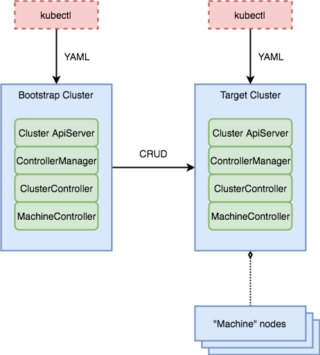

# Design

### Introduction

The general design of the cluster API is to manage Kubernetes clusters from a management Kubernetes cluster.  This allows a user to interact with the management cluster with the same set of CLIs and same type of APIs that would be used to interact with the target cluster.  This also means users may interact with the cluster api using kubectl, in addition to using the clusterctl CLI.




##### Definitions

| Term | Definition |
| --- | --- |
| clusterctl | a CLI primarily used to bring up the bootstrap cluster and create the target cluster. |
| Bootstrap Cluster | The temporary cluster created by clusterctl that is in turned used to create the target cluster. This cluster may be an existing cluster or a new cluster created on minikube. |
| Target Cluster | The desired final cluster. |
| Cluster ApiServer | Implements the API objects that users will interact with, such as cluster, machines, machineset, and machinedeployment |
| controller manager | Manages the vendor-specific machine and cluster controllers |
| cluster controller | Vendor-specific controller.  This controller is optional. |
| machine controller | Vendor-specific controller.  This controller handles creating, deleting, and updating machine creation. |
| machineset controller | |
| machinedeployment controller | |

### Why use Kubernetes to manage Kubernetes?

Often, developers will first look at the current cluster api design and ask why start a kubernetes cluster to manage the lifecycle of other kubernetes clusters.  Why not stand up a simple REST server that implement the cluster API that would then manage the lifecycle of other kubernetes clusters?  The answer to this is both philosophical and practical.  Remember the goal of the cluster api project is to create a **common** platform to manage cluster lifecycle, regardless of the underlying infrastructure.

1. KISS.  One design pattern.  One API approach throughout.  Once another API technology is introduced, then there are now multiple API technology and interaction surfaces.  A user can interact with Kubernetes with kubectl.  Another API technology surface now introduces yet another model to interact with the system.  Complexity should best be avoided.
2. Provisioning the "management" layer.  Provisioning Kubernetes and API controllers is well understood.  It may not always be easy for users, but the process is well understood.  Standing up a traditional, fat server that exposes a REST API maybe the first idea that comes to many developers.  However, this doesn't solve the problem of how to get the API endpoint up and running initially.  When the povisioning of the endpoint is left to interpretation, each vendor could unintentionally build in differences that would make the project diverge.
3. Day 2 operation on the management server.  Kubernetes, as a common platform, has built in a lot of convenient futures for day 2 operations that the management server inherit for free by building on top of Kubernetes.  For example, Kubernetes makes it very easy to upgrade the server components of the cluster api. 

### Personas

In the enterprise, users can be categorized into personas (or roles).  Each persona has different needs and requirements.  For instance, an administrators need central control over the resources under their purview.  They may also need full accounting of the resources allocated and used by developers.  On the other hand, developers does not care about central control or accounting.

Today, the cluster API is mostly concerned about the developer personas.  The vSphere provider does allow some separation of the personas, but it is a little superficial.  This will change as the cluster API and the vSphere provider evolve.  There will be a discussion of possible future directions towards the end of this page.

| Persona | Responsibility |
| --- | --- |
| Administrators | Create vSphere resource pool. |
| Developers | Create and delete clusters in the given resource pool. |

### Multitenancy

Multitenancy at the application-level is not a topic that is currently being tackled with the cluster API.  That version of multitenancy is left the in-cluster operations, which is outside the concerns of the cluster API.  It's main focus is creating the cluster.  However, it should be ready to enable kubernetes' application-level multitenancy when this feature is defined.  There is some thoughts about enabling cluster-level multitenancy, but this is also a topic that is not well defined.

### Cross cloud deployment

### Clusterctl CLI

The clusterctl CLI is a large enough topic to justify a separate page.  Please [go here](clusterctl.md) for a deeper discussion of the design and workflow of the clusterctl CLI.

### Cluster and Machine Controller

These are the controllers that the vendor-specific repos must implement.  These are the controller that creates and deletes machines and clusters on the vendor's infrastructure.  They are not the actual cluster API controllers.  Each must implement a respective *actuator* interface.  The [cluster actuator](https://github.com/kubernetes-sigs/cluster-api/blob/master/pkg/controller/cluster/actuator.go) and [machine actuator](https://github.com/kubernetes-sigs/cluster-api/blob/master/pkg/controller/machine/actuator.go) are both defined in the main cluster api repo.

cluster.Actuator
```
// Actuator controls clusters on a specific infrastructure. All
// methods should be idempotent unless otherwise specified.
type Actuator interface {
	// Create or update the cluster
	Reconcile(*clusterv1.Cluster) error
	// Delete the cluster.
	Delete(*clusterv1.Cluster) error
}
```

machine.Actuator
```
// Actuator controls machines on a specific infrastructure. All
// methods should be idempotent unless otherwise specified.
type Actuator interface {
	// Create the machine.
	Create(*clusterv1.Cluster, *clusterv1.Machine) error
	// Delete the machine. If no error is returned, it is assumed that all dependent resources have been cleaned up.
	Delete(*clusterv1.Cluster, *clusterv1.Machine) error
	// Update the machine to the provided definition.
	Update(*clusterv1.Cluster, *clusterv1.Machine) error
	// Checks if the machine currently exists.
	Exists(*clusterv1.Cluster, *clusterv1.Machine) (bool, error)
}
```

### Data Flow

| Input | Source |
| --- | --- |
| Cluster API ApiServer Yaml | Hard coded in main repo. Used by clusterctl CLI to deploy the ApiServer. |
| Node startup scripts | Hard coded in vendor-specific repo.  Used by clusterctl CLI to standup a Kubernetes node. |
| Master startup scripts | Hard coded in vendor-specific repo.  Used by clusterctl CLI to standup a Kubernetes master. |
|


##### API Objects
| Components | Defninition |
| --- | --- |
| Cluster | New API object defined by the cluster api to represent a cluster.  Users may inspect this object by using `kubectl describe cluster <name>`. |
| Machines | New API object defined by the cluster api to represent a machine.  Users may inspect this object by using `kubectl describe machines` |
| MachineSet | |
| MachineDeployment | |


### Addons


### Future Directions